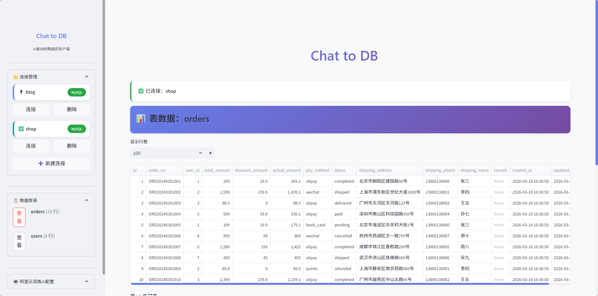
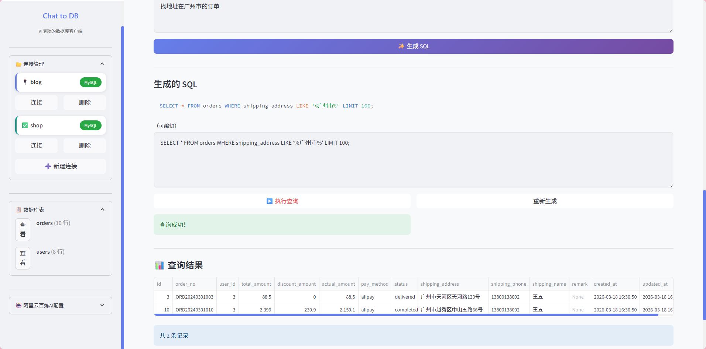
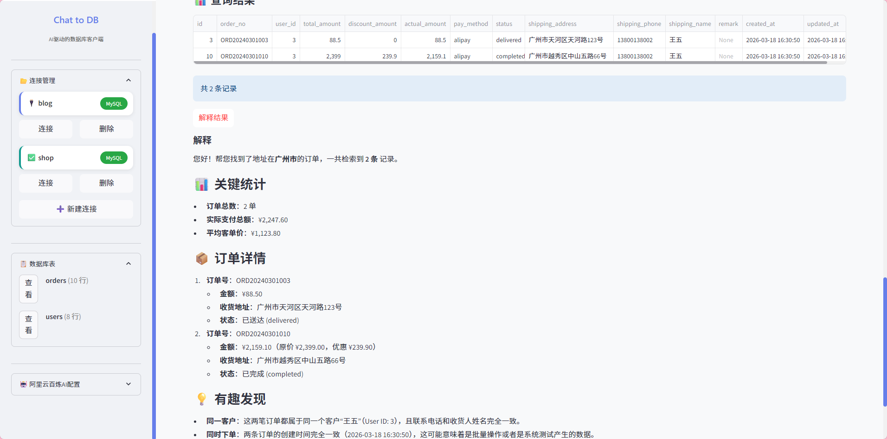

# AI 数据库客户端 (talk_to_db)

基于 AI 的智能数据库客户端，自然语言转 SQL，模拟 Navicat 交互体验。







## 功能特性

### 🤖 AI 智能 SQL 生成
- 基于 LangChain + 阿里云百炼大模型
- 自动获取数据库表结构作为上下文
- 支持 SQL 语法高亮、可编辑执行

### 🗄️ 多数据库连接管理
- 支持 MySQL 多连接保存、切换、删除
- 类似 Navicat 的连接管理体验

### 📊 表数据可视化
- 侧边栏展示所有表及行数
- 点击表名直接查看数据
- 支持自定义分页（10-1000 行）

### ✏️ SQL 编辑与执行
- SQL 语法高亮显示
- 支持编辑后再执行
- AI 查询结果智能解释

## 技术栈

- **后端**：Python
- **框架**：Streamlit
- **数据库**：MySQL (PyMySQL)
- **AI**：LangChain + 阿里云百炼 (DashScope)

## 快速开始

### 1. 克隆项目

```bash
git clone https://github.com/your-username/talk_to_db.git
cd talk_to_db
```

### 2. 安装依赖

```bash
pip install -r requirements.txt
```

或使用 pyproject.toml：

```bash
pip install pymysql streamlit python-dotenv langchain langchain-openai dashscope pandas
```

### 3. 配置环境变量

复制 `.env.example` 为 `.env`，填入你的配置：

```env
# 阿里云百炼 API 密钥
DASHSCOPE_API_KEY=your-api-key

# 模型名称（可选）
DASHSCOPE_MODEL=qwen3.5-flash

# 数据库配置（可选）
DB_HOST=192.168.10.100
DB_PORT=3306
DB_USERNAME=your-username
DB_PASSWORD=your-password
DB_NAME=your-database
```

获取 API 密钥：[阿里云百炼控制台](https://dashscope.console.aliyun.com/)

### 4. 运行项目

```bash
streamlit run app.py
```

浏览器打开 http://localhost:8501 即可使用。

## 使用说明

### 1. 连接数据库
- 点击侧边栏「新建连接」
- 填写连接信息（主机、端口、用户名、密码、数据库名）
- 保存并连接

### 2. AI 查询
- 在「自然语言查询」标签页
- 用中文描述你的查询需求
- 点击「生成 SQL」
- 查看生成的 SQL，可编辑后执行

### 3. SQL 编辑器
- 在「SQL 编辑器」标签页
- 直接编写 SQL 语句
- 执行查看结果

### 4. 查看表数据
- 侧边栏会显示所有表
- 点击「查看」按钮查看表数据

## 项目结构

```
talk_to_db/
├── app.py           # Streamlit 主应用
├── ai_services.py   # AI 服务（SQL 生成、结果解释）
├── database.py      # 数据库操作
├── pyproject.toml   # 项目配置
├── .env             # 环境变量
└── assets/          # 静态资源
```

## 注意事项

- 确保 MySQL 服务器正常运行
- 阿里云百炼 API 密钥有效
- 支持的模型：qwen3.5-flash、qwen-turbo、qwen-max 等

## License

MIT License
